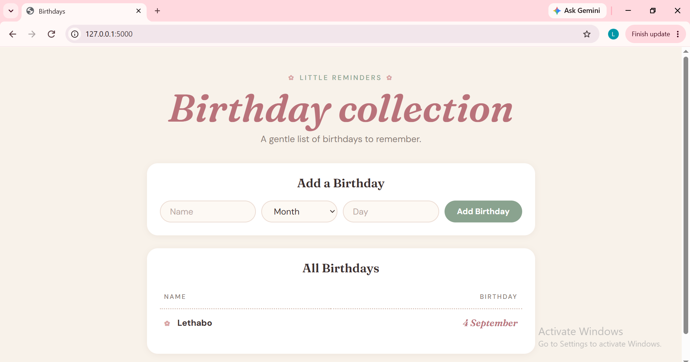

# Birthdays

A small Flask app for keeping track of birthdays. Add a name, month and day, and see everyone's birthdays in one list.

I built this to practise Flask, Jinja templates and SQLite, and then gave it a soft lifestyle-blog redesign with plain CSS, featuring CRUD functionality and persistent data storage

## Screenshots



## Features

- Add a birthday with a name, month (dropdown) and day
- View all saved birthdays in a table
- Entries are stored in a SQLite database
- Responsive layout: the form wraps neatly on smaller screens

## Built with

- Python and Flask
- SQLite (using Python's built-in `sqlite3` module)
- Jinja templates
- HTML and CSS (Fraunces and DM Sans from Google Fonts)

## Run it locally

1. Clone the repo and move into the folder:
   ```
   git clone https://github.com/naniki-dev/save-your-birthday.git
   cd save-your-birthday
   ```
   
3. Install the dependencies:
   ```
   pip install -r requirements.txt
   ```
4. Start the app:
   ```
   flask run
   ```
5. Open the address Flask prints in the terminal (usually `http://127.0.0.1:5000`).

## Project structure

```
app.py              Flask routes and database logic
templates/          Jinja templates
static/styles.css   Styling
```

## What I learned

- Handling form submissions with Flask (`GET` and `POST`)
- Reading from and writing to SQLite with `sqlite3`
- Looping through database rows in a Jinja template
- Restyling a page with CSS variables, flexbox and Google Fonts


## Future Improvements

Potential improvements include:

* Edit existing birthday entries
* Delete birthday entries
* Validate user input
* Add error handling
* Add birthday search functionality
* Sort birthdays chronologically
* Highlight upcoming birthdays
* Add user authentication
* Add automated tests
* Deploy the application to a cloud platform

## Project Background

This project was originally developed as part of the **CS50x** coursework and subsequently adapted to use Python's standard `sqlite3` library rather than the CS50 SQL library.

The implementation was used as an opportunity to apply the concepts independently and better understand how Flask applications interact directly with SQLite databases.

## License

This project is intended for educational and portfolio purposes.
